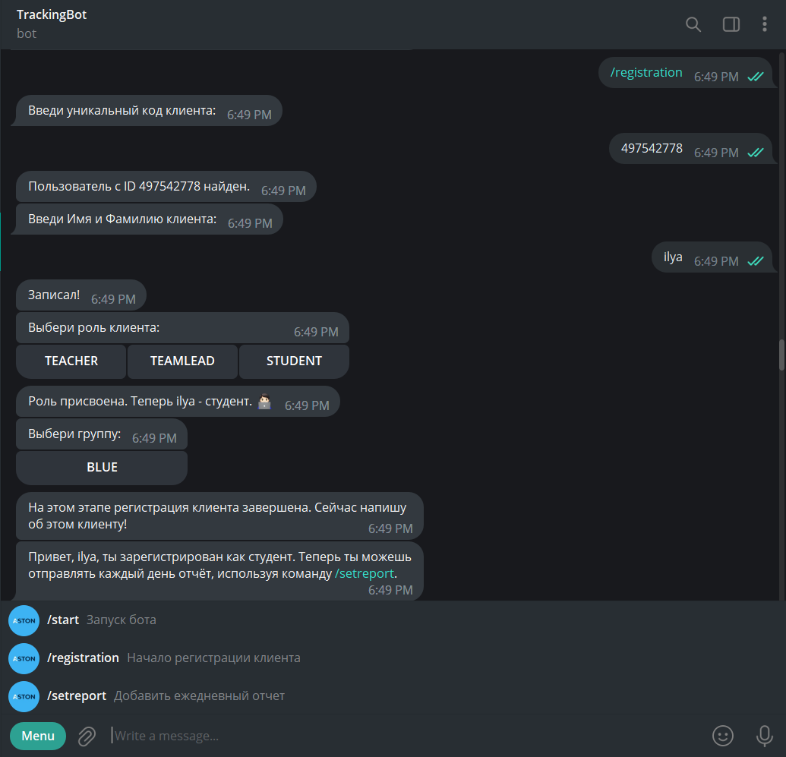
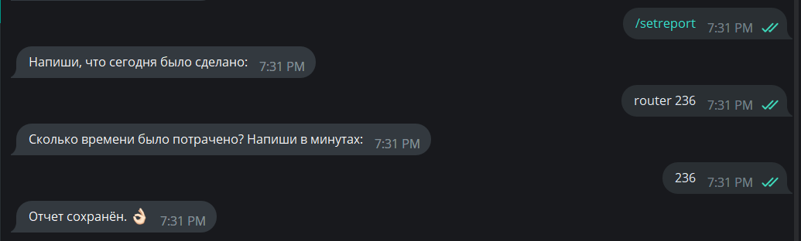

# Time tracker as telegram bot
Student sends his daily tasks with description and time spent to telegram bot.  
At the end of the day sends report of all students' tracks to teacher's telegram in PDF format.  
Does notify teamlead, if student missed writing his report once and teacher, if missed twice in a row.  

  

Router service combines SOAP and REST styles.  

Add task example:
---
  

Send report to teacher example:
--- 
  

The application uses microservices architecture and consists of:  
---
- TelegramBot and Service router
- [Service command](https://github.com/mariesemenyuk/serviceCommand)  
- [Service notifier](https://github.com/gamakarenko/notification)  
- [Service sender](https://github.com/Ramz3301/tgbot)
- [Service accountant](https://github.com/Gretchen-z/accountant)
